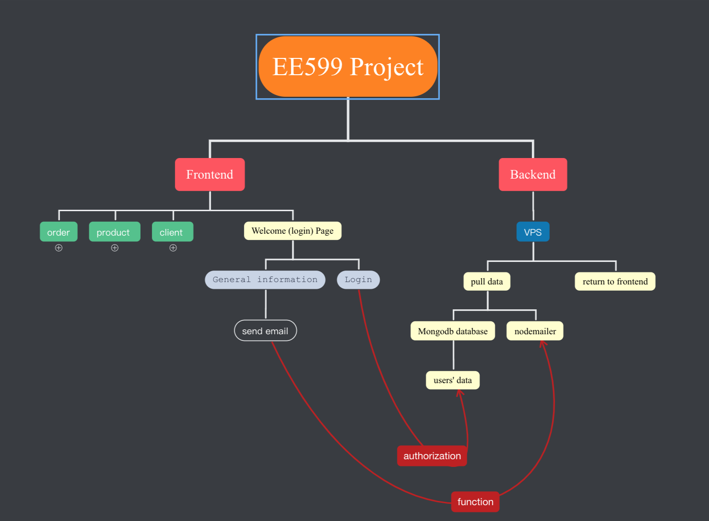
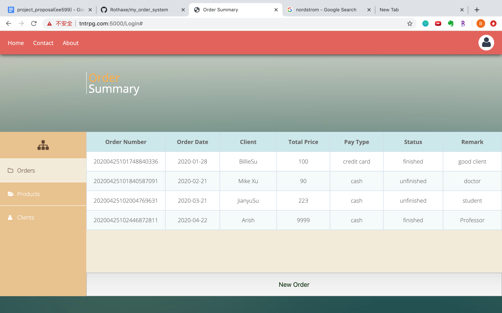
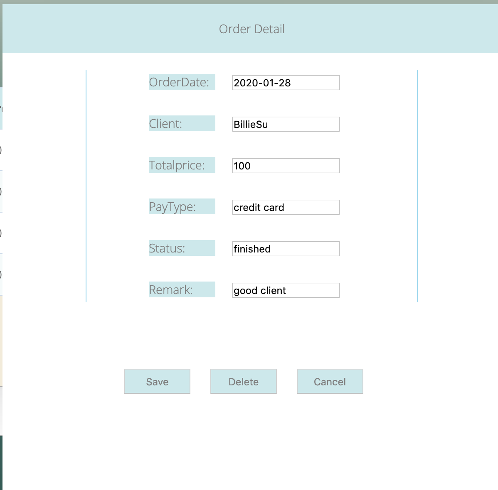
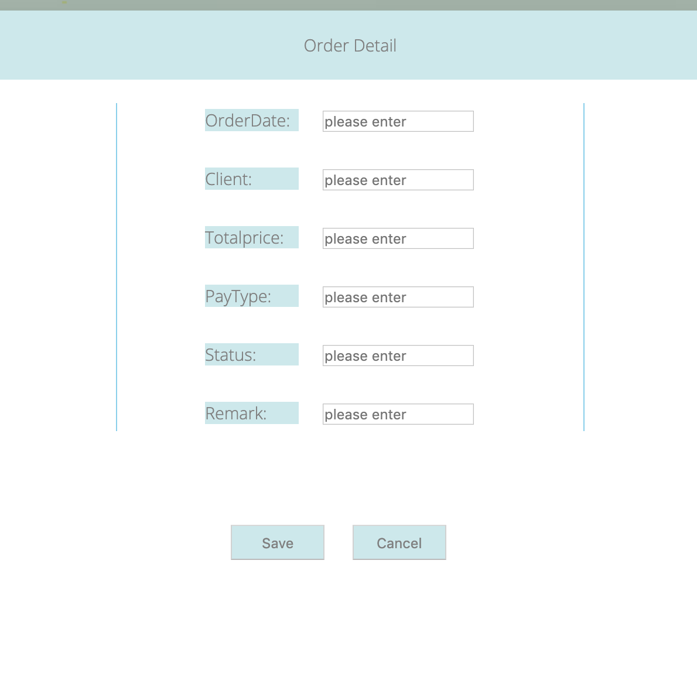

# Order Management System

### We depoy this web in the AliCLoud, you can visited with url: `http://tntrpg.com:5000`. This is a full-stack project (including front-end in `html/css/javascript/Bootstrap` and back-end in `nodejs/MongoDB`). We will create A web that allows retailers to manage all orders. Each time when retailers input the message, the database will keep these massages.

-This is our frontend and backend layout.

- The frontend is set to send the `creat/edit/delete`  `order/client/product` massage for allowing retailers to manage all business massage. These modification can be sent to the backend using HTTP GET/POST request. 

- This is the create new order window for tailer to `input new order`(similar with client/product) massage.

- This is the Modify order window for tailer to `modify existed order`(similar with client/product) massage.

#### - The backend is a simple NodeJS server that processes the HTTP `GET/POST` request, return all former kept massage to frontend in the begining. Atfer it receive the massage created by `input` from frontend, it will keep these changes into `MangoDB database` and returns the result back to the frontend.

### we still need to do:
#### - connect with the these three collections (client/order/product), when the product add/subtract in specific order, the total remaining product number will also substract/add in product page
#### - add password function for user